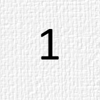
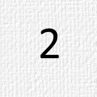
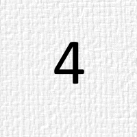
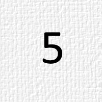

Test Table

| Heading 01 | Heading 02 | Heading 03 |
|------------|------------|------------|
| Cell 11    | Cell 12    | Cell 13    |
| Cell 21                                                                         Cell 21                                                                         Cell 21                                                                         Cell 21                                                                         Cell 21                                                                         Cell 21                                                                         Cell 21    | Cell 22                                                                         Cell 22                                                                         Cell 22                                                                         Cell 22                                                                         Cell 22                                                                         Cell 22                                                                         Cell 22                                                                         Cell 22                                                                         Cell 22                                                                         Cell 22                                                                         Cell 22    | Cell 23                                                                         Cell 23                                                                         Cell 23                                                                         Cell 23                                                                         Cell 23                                                                         Cell 23                                                                         Cell 23                                                                         Cell 23                                                                         Cell 23                                                                         Cell 23    |
| Cell 31    | Cell 32    | Cell 33    |
| Cell 41    | Cell 42    | Cell 43    |

Test Table

Test of TOC

**Table of contens**

[TOC]

The above works only on StackEdit, on GitHub it does not work
so TOC have to be build manually.

Header level 1 Aaaaaaaaaaaaaaaaaaaaaa
==============

Header level 2 AAAaaaaaaaaa
--------------

### Header level 3 AAAaaa 111111111

### Header level 3 AAAaaa 222222222

### Header level 3 AAAaaa 33333333

### Header level 3 AAAaaa 44444444

Header level 2 AAAbbbbbbbb
--------------

### Header level 3 AAAbbb 11111111

### Header level 3 AAAbbb 22222222

Header level 2 AAAcccccccc
--------------

### Header level 3 AAAccc 111111111

Header level 1 Bbbbbbbbbbbbbbbbbbbbbb
==============

Header level 2 BBBaaaaaaaaa
--------------

### Header level 3 BBBaaa 1111111111

Header level 2 BBBbbbbbbbbb
--------------

### Header level 3 BBBbbb 11111111111

### Header level 3 BBBbbb 22222222222

Header level 2 BBBcccccccccc
--------------

### Header level 3 BBBccc 11111111111

### Header level 3 BBBccc 22222222222

### Header level 3 BBBccc 33333333333

Header level 1 Ccccccccccccccccccccc
==============

Header level 2 CCCaaaaaaaaa
--------------

### Header level 3 CCCaaa 1111111111

Header level 2 CCCbbbbbbbbb
--------------

### Header level 3 CCCbbb 1111111111

Header level 1 Ddddddddddddddddddddd
==============

Header level 2 DDDaaaaaaaaa
--------------

### Header level 3 DDDaaa 1111111111

Header level 1 Eeeeeeeeeeeeeeeeeeee
==============

Test of TOC

Test of Table of images

**Table of images**

[Image 1: Picture 1](#image1)

[Image 2: Picture 2](#image2)

[Image 3: Picture 3](#image3)

[Image 4: Picture 4](#image4)

[Image 5: Picture 5](#image5)

In the middle there is some short text. I do not have
idea what to write here but there have to be some text.

**Some images**

In the middle there is some short text. I do not have
idea what to write here but there have to be some text.

<a name="image1">

Image 1: Picture 1

In the middle there is some short text. I do not have
idea what to write here but there have to be some text.

<a name="image2">

Image 2: Picture 2

In the middle there is some short text. I do not have
idea what to write here but there have to be some text.

<a name="image3">

Image 3: Picture 3

In the middle there is some short text. I do not have
idea what to write here but there have to be some text.

<a name="image4">

Image 4: Picture 4

In the middle there is some short text. I do not have
idea what to write here but there have to be some text.

<a name="image5">

Image 5: Picture 5

In the middle there is some short text. I do not have
idea what to write here but there have to be some text.

Test of Table of images

Test some rulers

Dashes

----------

Asterisks

**********

Dashes with spaces

- - - - - - -

Test some rulers
