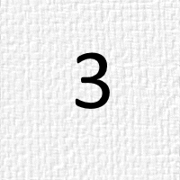

Test Table

| Heading 01 | Heading 02 | Heading 03 |
|------------|------------|------------|
| Cell 11    | Cell 12    | Cell 13    |
| Cell 21                                                                         Cell 21                                                                         Cell 21                                                                         Cell 21                                                                         Cell 21                                                                         Cell 21                                                                         Cell 21    | Cell 22                                                                         Cell 22                                                                         Cell 22                                                                         Cell 22                                                                         Cell 22                                                                         Cell 22                                                                         Cell 22                                                                         Cell 22                                                                         Cell 22                                                                         Cell 22                                                                         Cell 22    | Cell 23                                                                         Cell 23                                                                         Cell 23                                                                         Cell 23                                                                         Cell 23                                                                         Cell 23                                                                         Cell 23                                                                         Cell 23                                                                         Cell 23                                                                         Cell 23    |
| Cell 31    | Cell 32    | Cell 33    |
| Cell 41    | Cell 42    | Cell 43    |

Test Table

Test of TOC

**Table of contens**

[TOC]

Header level 1
==============

Header level 2
--------------

### Header level 3

### Header level 3

### Header level 3

### Header level 3

Header level 2
--------------

### Header level 3

### Header level 3

Header level 2
--------------

### Header level 3

Header level 1
==============

Header level 2
--------------

### Header level 3

Header level 2
--------------

### Header level 3

### Header level 3

Header level 2
--------------

### Header level 3

### Header level 3

### Header level 3

Header level 1
==============

Header level 2
--------------

### Header level 3

Header level 2
--------------

### Header level 3

Header level 1
==============

Header level 2
--------------

### Header level 3

Header level 1
==============

Test of TOC

Test of Table of images

**Table of images**

[Image 1: Picture 1](#image1)
[Image 2: Picture 2](#image2)
[Image 3: Picture 3](#image3)
[Image 4: Picture 4](#image4)
[Image 5: Picture 5](#image5)

In the middle there is some short text. I do not have
idea what to write here but there have to be some text.

**Some images**

In the middle there is some short text. I do not have
idea what to write here but there have to be some text.

<a name="image1">

Image 1: Picture 1

In the middle there is some short text. I do not have
idea what to write here but there have to be some text.

<a name="image2">

Image 2: Picture 2

In the middle there is some short text. I do not have
idea what to write here but there have to be some text.

<a name="image3">

Image 3: Picture 3

In the middle there is some short text. I do not have
idea what to write here but there have to be some text.

<a name="image4">

Image 4: Picture 4

In the middle there is some short text. I do not have
idea what to write here but there have to be some text.

<a name="image5">

Image 5: Picture 5

In the middle there is some short text. I do not have
idea what to write here but there have to be some text.

Test of Table of images

